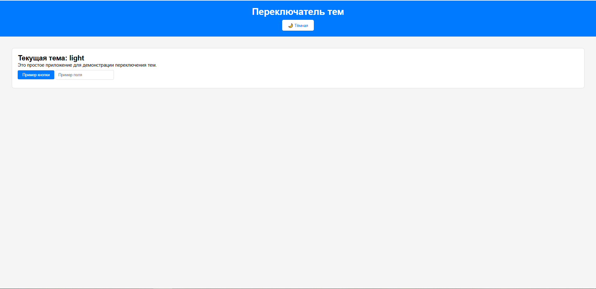
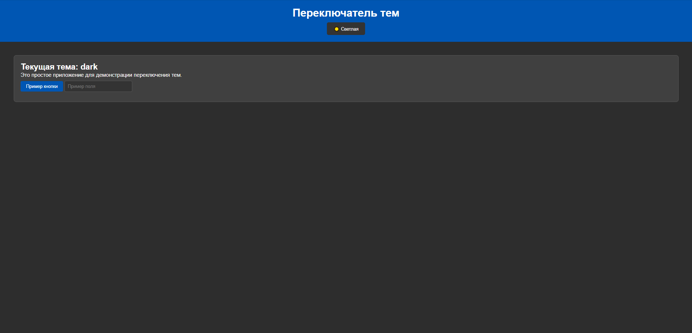

# Theme Switcher - Переключатель тем

React-приложение с функцией переключения между светлой и тёмной темами. Разработано в рамках контрольной работы #4 на основе React.

## 🚀 Демонстрация

### Светлая тема


### Тёмная тема  


## ✨ Возможности

- 🔄 **Переключение тем** - мгновенное изменение между светлой и тёмной темами
- 💾 **Сохранение выбора** - автоматическое сохранение предпочтений в localStorage
- ⚡ **Плавные переходы** - анимированное изменение стилей
- 📱 **Адаптивный дизайн** - корректное отображение на всех устройствах
- 🎨 **Кастомные стили** - уникальное оформление для каждой темы

## 🛠 Технологии

- **React 18** - библиотека для построения пользовательских интерфейсов
- **CSS3** - каскадные таблицы стилей с использованием transitions
- **Local Storage API** - сохранение состояния темы
- **React Hooks** - useState, useEffect для управления состоянием

## 📦 Установка и запуск

### Предварительные требования
- Node.js (версия 14 или выше)
- npm или yarn

### Шаги установки

1. **Клонирование репозитория**
   ```bash
   git clone https://github.com/ваш-username/theme-switcher.git
   cd theme-switcher
